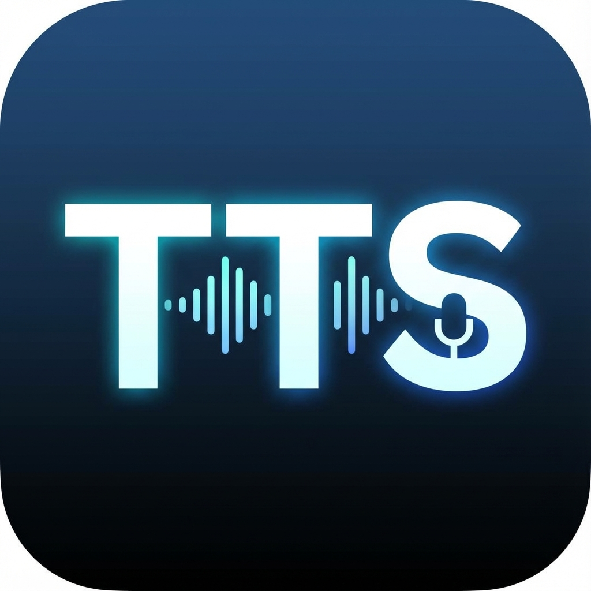

# TTS Desktop

Ứng dụng Desktop Text-to-Speech sử dụng Google Gemini AI với hỗ trợ giọng vùng miền Việt Nam.

<p align="center">
  
</p>

## ✨ Tính năng

- 🎤 **30+ giọng đọc** từ Google Gemini TTS
- 🇻🇳 **11 giọng vùng miền** Việt Nam (Bắc, Huế, Nghệ An, Quảng Nam, Sài Gòn, Miền Tây,...)
- 🔍 **Tìm kiếm giọng** nhanh chóng
- 🎧 **Nghe thử giọng** trước khi chọn
- 💾 **Lưu file WAV** về máy
- 🌙 **Dark mode** đẹp mắt
- 🔐 **API key cá nhân** - không share key

## 🛠️ Công nghệ

- **Frontend**: Vue 3 + Vite + TailwindCSS + Element Plus
- **Desktop**: Electron
- **TTS Engine**: Google Gemini 2.5 Flash TTS
- **Icons**: Lucide Vue

## 📦 Cài đặt

### 1. Clone repository

```bash
git clone https://github.com/AntherEr/tts-desktop.git
cd tts-desktop
```

### 2. Cài đặt dependencies

```bash
npm install
```

### 3. Lấy API Key

1. Truy cập [Google AI Studio](https://makersuite.google.com/app/apikey)
2. Tạo API key mới
3. Chạy app và nhập key vào phần **Cài đặt**

### 4. Chạy ứng dụng

```bash
# Development (Web UI only)
npm run dev

# Development (Electron app)
npm run electron:dev

# Build for production
npm run build
```

## 🎯 Sử dụng

1. Mở ứng dụng
2. Nhập API key (nếu chưa có)
3. Nhập văn bản cần đọc
4. Chọn **giọng đọc** (Nam/Nữ)
5. Chọn **giọng vùng miền**
6. Nhấn **Tạo Giọng Đọc**
7. Nghe và lưu file

## 🗣️ Giọng vùng miền

| Vùng | Đặc điểm |
|------|----------|
| 🇻🇳 Bắc (Chuẩn) | Rõ ràng, trong trẻo |
| 🏛 Hà Nội | Thanh lịch, nhẹ nhàng |
| 🌊 Huế | Chậm rãi, trầm ấm |
| 🏔 Nghệ An | Nặng, mộc mạc |
| 🌾 Quảng Nam | Nặng, thô, chậm |
| 🌻 Bình Định | Thẳng thắn |
| 🌉 Đà Nẵng | Vừa phải, dễ nghe |
| 🌴 Nam (Chuẩn) | Tự nhiên, thân thiện |
| 🌆 Sài Gòn | Trẻ trung, năng động |
| 🚤 Miền Tây | Hiền hòa, mộc mạc |
| 🍃 Cần Thơ | Nhẹ nhàng, dễ thương |

> ⚠️ **Lưu ý**: Giọng vùng miền được mô phỏng bằng prompt engineering, kết quả có thể khác nhau.

## 📝 Cấu trúc dự án

```
tts-desktop/
├── electron/
│   ├── main.ts           # Electron main process
│   ├── preload.ts        # Preload script
│   └── services/
│       └── geminiTTS.ts  # TTS service
├── src/
│   ├── components/
│   │   ├── TTSForm.vue       # Main TTS form
│   │   ├── AccentSelect.vue  # Accent dropdown
│   │   └── ApiSettings.vue   # API settings modal
│   ├── styles/
│   │   └── main.css      # TailwindCSS
│   ├── App.vue           # Main app component
│   └── main.ts           # Vue entry point
├── public/               # Static assets
└── package.json
```

## 📄 License

MIT License - [HuyDQ](https://github.com/danieldev23)

## 🤝 Đóng góp

Mọi đóng góp đều được hoan nghênh! Hãy tạo Pull Request hoặc Issue.

---

Made with ❤️ by [HuyDQ](https://github.com/danieldev23)
